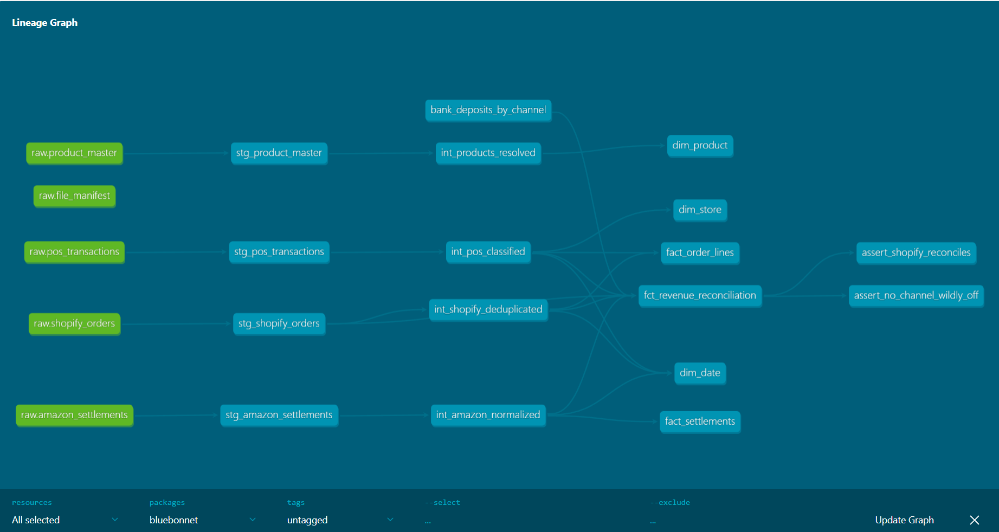

# Bluebonnet Revenue Platform

[](https://github.com/vamkotss/bluebonnet-revenue-platform/actions/workflows/ci.yml)



**A Texas home-goods retailer sells through Shopify, Amazon, and 12 physical stores...**

**A Texas home-goods retailer sells through Shopify, Amazon, and 12 physical stores. Three channel reports never agree with the bank deposits — refunds land weeks late, Amazon settles in fee-netted batches, and POS files sometimes never arrive. Finance loses four days a month stitching it together in Excel. This is the pipeline that produces one trusted daily net-revenue number by channel — and that ties to the bank, on a schedule, with alarms when it breaks.**

> **The hard part isn't moving the data. It's making the books tie — and being honest about where they don't.**
>
> This pipeline reconciles warehouse revenue to the bank by channel. Shopify ties to **0.2%**. But POS is off **1.3%** — and that gap is *real data loss* from missing store files, flagged rather than papered over. Amazon is off **4.5%** from settlement-timing on refunds, documented as a residual that closes as later settlements arrive. A fake-perfect tie would have hidden both. Surfacing them, with a reason, is what makes the number trustworthy.

---

## What this demonstrates

This is a data-engineering project, so **the pipeline is the deliverable** — not a one-off analysis. It runs nightly, idempotently, and proves itself on every commit. It handles the three things take-home projects skip and real jobs demand:

- **Idempotency** — kill the loader mid-run, re-run it, and the warehouse ends up byte-identical to a clean run. No double-counting, ever.
- **Late-arriving data** — refunds that land weeks after the order, Amazon settlements delayed two weeks, all reconciled to the correct dates.
- **Reconciliation** — the warehouse ties to a synthetic bank feed by channel, within tolerance, with every residual explained.

**Stack:** Python · PostgreSQL 16 · dbt · Apache Airflow · Docker · GitHub Actions · pandas · SQLAlchemy

---

## Architecture

```
  4 broken sources          raw (EL)              dbt (T)                 marts
 ┌─────────────────┐   ┌──────────────┐   ┌──────────────────┐   ┌──────────────────┐
 │ Shopify JSON     │   │              │   │ staging          │   │ fact_order_lines │
 │ Amazon CSV       │──▶│ idempotent   │──▶│  standardize     │──▶│ fact_settlements │
 │ POS CSVs         │   │ ingestion    │   │ intermediate     │   │ dim_product      │
 │ Product Excel    │   │ + manifest   │   │  clean (rulings) │   │ dim_store        │
 └─────────────────┘   └──────────────┘   │ marts            │   │ dim_date         │
                                           │  star schema     │   │ reconciliation   │
                                           └──────────────────┘   └──────────────────┘
                                                                            │
   Airflow DAG orchestrates:  sense → load → dbt run → dbt test → publish   ▼
                                                                     ties to bank feed
```

Raw stays a **faithful copy** of the messy sources — duplicates, bad encodings and all. Cleaning happens in dbt, where every ruling is visible and tested. That separation means you can always answer *"was this wrong in the source, or did my pipeline break it?"*

---

## The four sources are deliberately broken — the way real data is

A seeded generator builds 18 months of history with the exact pathologies each real system produces:

| Source | How it's broken |
|---|---|
| **Shopify** (paginated JSON) | Schema drift mid-year (flat `discount` → nested `discount_allocations`), ~2% duplicate orders from API retries, refunds arriving later as separate objects |
| **Amazon** (settlement CSVs) | Batched and delayed 14 days, fees netted out, occasional un-converted CAD rows, a mid-year column rename |
| **POS** (nightly per-store CSVs) | Missing nights from flaky stores, a Windows-1252 encoded file that breaks a naive UTF-8 read, a store clock 40 minutes off, and negative-quantity rows that are *training transactions*, not returns |
| **Product master** (Excel) | Merged title cell pushing the real header to row 2, a SKU format change, duplicate SKUs with conflicting costs, and a hidden "do not use" sheet |

Because the defects are injected, they're **known** — so every cleaning step is tested against a manifest rather than eyeballed.

---

## Idempotency: the property that says "data engineer"

The loader records every file it processes in a **content-hash manifest**. Before loading a file, it asks *"have I already loaded these exact bytes?"* — and the load plus the manifest write happen in a single transaction, so a crash between them rolls back cleanly.

The proof is a test that simulates the real-world failure:

```
Load killed at file 2,000 of 5,780  →  13,592 rows in the warehouse
Restart the loader                  →  skips the 2,000 done, loads the rest
Final row count                     →  39,817
A clean single run                  →  39,817   ✓ identical
```

A crash plus a restart converges to exactly the clean state. That's what makes the whole pipeline safe to retry, and it's why the Airflow tasks can retry aggressively without corrupting anything.

---

## The star schema, and one decision worth defending

The marts are a classic star: two fact tables and three dimensions. The decision an interviewer will probe is **why Amazon is a separate fact table**:

Shopify and POS recognize revenue on the **order date**. Amazon recognizes it at **settlement** — about 14 days later, net of a 15% fee. Putting them in one fact table would either double-count or misdate Amazon's revenue. Two facts, each reconciling to the bank on its own basis, is the honest model. A test enforces it: Amazon may never appear in `fact_order_lines`.

Every cleaning ruling in the intermediate layer is likewise explicit and tested:

| Ruling | Decision |
|---|---|
| Shopify retry duplicates | Keep one row per natural key |
| Amazon CAD rows | Convert to USD at a stated reference rate |
| POS negatives | A return **only if** `txn_type = 'sale'`; training rows are dropped entirely |
| Duplicate SKUs | Keep the lowest conflicting cost — never overstates margin |

---

## Reconciliation: making the books tie, honestly

The bank deposit feed is the control — the money that actually landed, by channel, on a cash basis. The warehouse must reproduce it from the messy sources.

| Channel | Warehouse | Bank | Gap | Status |
|---|---|---|---|---|
| Shopify | $13.56M | $13.58M | −0.19% | **RECONCILED** |
| POS | $5.97M | $6.05M | −1.30% | RESIDUAL — missing store files |
| Amazon | $9.39M | $8.99M | +4.49% | RESIDUAL — settlement timing |

Shopify has complete data and ties within 0.2%, proving the core revenue math. The two residuals are documented with a cause — and that honesty is the point. Two guardrail tests protect it: one fails if the fully-reconcilable channel drifts past 0.5%, another if any channel exceeds 10%. Both were verified by injecting deliberately corrupted revenue and watching the tests fail loudly, refusing to certify the bad data.

---

## Orchestration

An Airflow DAG runs the nightly flow: **sense → load → dbt run → dbt test → publish**. The order matters — `dbt test` runs *before* `publish`, so a night whose books don't reconcile never publishes, and bad data never reaches a dashboard. Downstream consumers read only published dates.

The DAG is deliberately thin: all the real work lives in tested Python functions, so the same code runs in a scheduled DAG, a backfill script, or a local debug — and is unit-tested without Airflow running at all. A [backfill runbook](docs/runbooks/BACKFILL.md) documents how to reprocess historical dates, which is safe precisely because the pipeline is idempotent.

---

## Continuous integration

Every push runs the whole pipeline on a fresh machine: a real Postgres 16 service container, the messy data generated, ingested, transformed, reconciled, and tested. **A pull request that breaks a model or a reconciliation guardrail cannot merge.** CI runs at a 2-month scale that keeps every defect present but completes in under a minute — the same code paths as a full run, faster.

---

## Run it yourself

```bash
# 1. Start the warehouse (Postgres 16 in Docker)
docker compose up -d

# 2. Set up Python
python -m venv .venv && source .venv/bin/activate    # Windows: .\.venv\Scripts\Activate.ps1
pip install -r requirements.txt && pip install dbt-postgres
export PYTHONPATH=src                                 # Windows: $env:PYTHONPATH = "src"

# 3. Generate the messy sources and the bank control
python -m generators.generate --mode history
python -m generators.make_bank_seed

# 4. Load raw (idempotent) and build the warehouse
python -m bluebonnet.ingest --source all --raw-dir data/raw --reset
cd dbt && dbt seed && dbt build && cd ..

# 5. Run the tests
pytest tests/ -q
```

The generator is seeded, so your output matches this repo. To run the full Airflow stack, see `docker-compose.airflow.yml`.

---

## Layout

| Path | |
|---|---|
| `generators/` | Seeded generator for the four broken sources + answer keys |
| `src/bluebonnet/ingest.py` | Idempotent, manifest-gated ingestion into raw Postgres |
| `src/bluebonnet/pipeline.py` | The nightly flow as tested functions |
| `dbt/models/staging` · `intermediate` · `marts` | The three-layer transform into a star schema |
| `dbt/models/marts/fct_revenue_reconciliation.sql` | The bank-reconciliation control |
| `airflow/dags/bluebonnet_daily.py` | The orchestration DAG |
| `docs/RECONCILIATION.md` · `docs/runbooks/BACKFILL.md` | Reconciliation report and backfill runbook |
| `.github/workflows/ci.yml` | The CI pipeline |
| `tests/` | The test suite, run on every push |

---

## Author

**Sri Vamsi Kota** — MS Business Analytics & AI, UT Dallas
[github.com/vamkotss](https://github.com/vamkotss)
